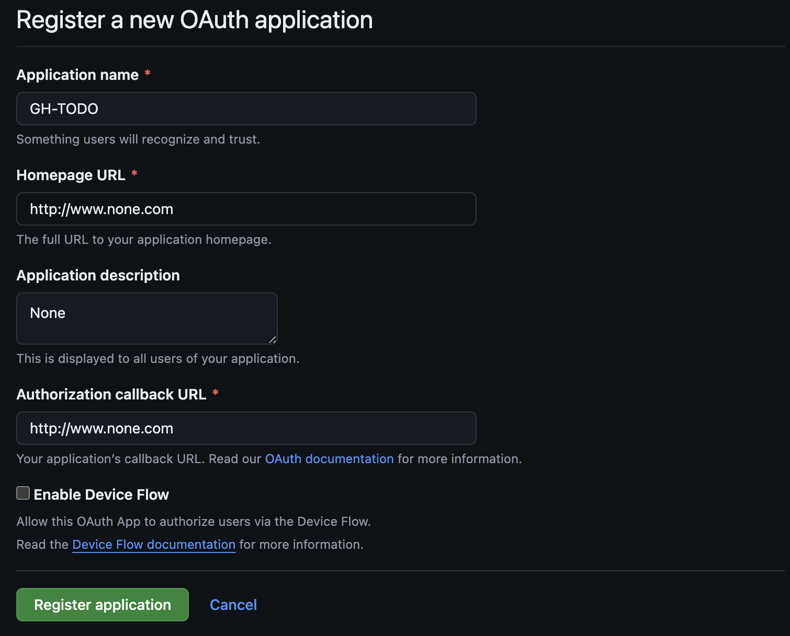
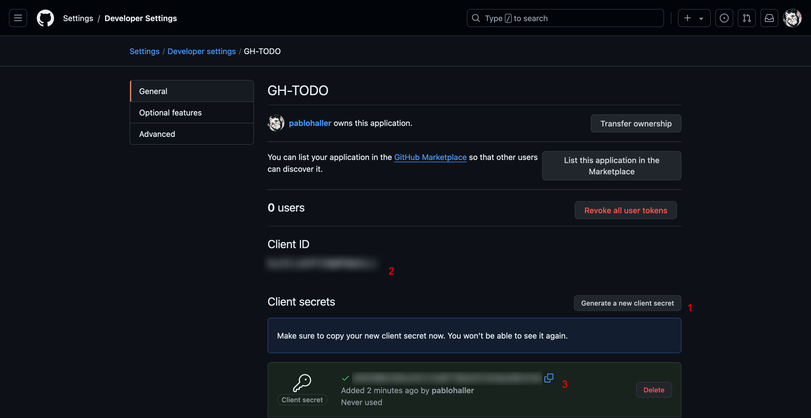
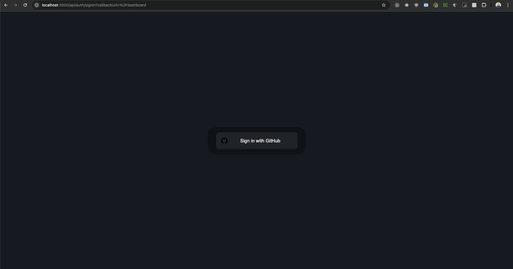
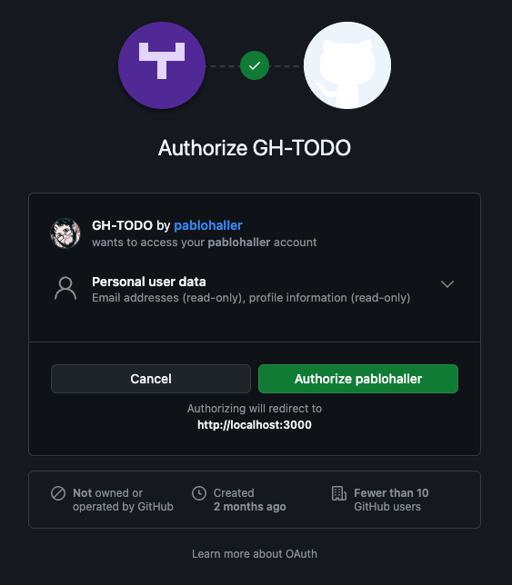

# OAuth GitHub authentication with Next.js and next-auth

Ever wondered how to easily set-up authentication with Next.js?

One of my favorite libraries to handle this problem is using `next-auth`, a library made specifically to handle many authorization providers, facilitating Single Sign On with services like Google, Discord, GitHub, and more.

With just a few steps, let me show you a simple way to authenticate using GitHub, and show your information on screen.

## Setup GitHub OAuth App

Open your browser, and go to GitHub's [Register a new OAuth Application form](https://github.com/settings/applications/new).

For now, feel free to add some placeholder information, but make sure to set your callback URL to: `http://localhost:3000/api/auth/callback/github`.



Then click on `Register application`, and your brand new app will be created!

## Generating your client secret

You'll be redirected to the app settings page; there, click on `Generate a new client secret` and wait until it displays below.



Once they are copied, paste them into an `.env` file in the root of your application.

Don't forget to create an `.env.example` for your future self to know what environment variables you need, or for anyone who wants to do some modifications on your code letting them know ahead what they need.

Also, please add them to your `.gitignore` file. That way you don't expose sensitive information/keys anywhere.

You'll end up having something like this:

```
// .env.example
GITHUB_CLIENT_ID=
GITHUB_CLIENT_SECRET=
```

```
// .gitignore
.env
```

## Adding `next-auth`

Run `npm i next-auth` to install the library.

Then, as we're using the `app` router, we'll need to use route handlers for the config. Create the following route:

```
// /app/api/auth/[...nextauth]/route.ts

import NextAuth, { NextAuthOptions } from "next-auth";
import GithubProvider from "next-auth/providers/github";

export const AUTH_OPTIONS: NextAuthOptions = {
  providers: [
    GithubProvider({
      clientId: process.env.GITHUB_CLIENT_ID!,
      clientSecret: process.env.GITHUB_CLIENT_SECRET!,
    }),
  ],
  secret: process.env.NEXTAUTH_SECRET!,
  session: {
    strategy: "jwt",
    maxAge: 60,
  },
};

const handler = NextAuth(AUTH_OPTIONS);

export { handler as GET, handler as POST };
```

What does this do?

Well, first, we create our auth options, an object that declares which providers we're using (e.g.: Github, Google, Twitch, whatever you can find for SSO options! You can find the full list [here](https://next-auth.js.org/providers)). As you can see, we need to specify the clientId and clientSecret, which we previously stored in our `.env` file.

We will also need to create a secret, and store it in our environment variables. This secret is going to be used to encrypt your JSON Web Token: an encoded field with useful information used for authentication and authorization purposes.

Check that for the `session` property, we specify the `jwt` strategy, setting the `maxAge` for the token (being this, the time that the application will allow us to stay logged in the application. Now, why only 60? Because this will help us see how next-auth automatically sign us out when the session expires. Change it accordingly to your needs!).

## Protecting our routes

The whole purpose of authentication is protecting our resources, in this case, our routes.

Let's create a `middleware`, which takes care of pre-processing all routes.

```
// middleware.ts

export { default } from "next-auth/middleware";

export const config = { matcher: ["/dashboard/:path*"] };
```

This is one of the many ways to do it, the most basic one.

We run the `next-auth` middleware in the Next.js middleware. Through the `config` object and its `matcher` property, we tell exactly on which routes to run it. You can check a little bit more about in [here](https://nextjs.org/docs/app/building-your-application/routing/middleware#matcher), with brief explanation about how Next middleware works, and [here](https://next-auth.js.org/configuration/nextjs#middleware) to know how `next-auth` one works.

## Creating the route

We're almost there!

Let's create a page for our dashboard.

```
// app/dashboard/page.tsx

import { getServerSession } from "next-auth";
import { AUTH_OPTIONS } from "../api/auth/[...nextauth]/route";
import Link from "next/link";

const Page = async () => {
  const session = await getServerSession(AUTH_OPTIONS);
  const { email, image, name } = session?.user || {};

  return (
    <Link className="p-2 block" href={`https://github.com/${name}`} passHref>
      <div className="bg-slate-200 hover:bg-slate-100 p-2.5 rounded-xl shadow-xl border border-slate-400 border-dashed gap-2.5 flex flex-col items-center">
        <div className="relative inline-flex justify-center items-center bg-primary size-48 rounded-full overflow-hidden shadow-2xl">
          
        </div>
        <p className="text-2xl font-bold">{name}</p>
        <p className="text-sm">{email}</p>
      </div>
    </Link>
  );
};

export default Page;
```

As you can see, it's a typical Next page, using `getServerSession` to print in page our session information. Nothing more, nothing less. It will provide us with our github user name, e-mail and profile picture url for later use as basic information.

## Testing Auth

Now, we can finally test quickly our authentication process. After you run the project, try accessing `/dashboard`.

You will be prompted with the following screen, provided by `next-auth` itself:



Once you click on it, you will be asked to grant permission from your GitHub account.



And once you authorize, you'll be redirected and finally see our own information!


If you wait long enough (a minute), you'll be logged out to the same log-in screen as before.

Now, you may ask, how can I sign out without having to wait for the token to expire?

Simply calling `signOut` from a client component is good enough, as it is detailed [here](https://next-auth.js.org/getting-started/client#signout).

## Conclusion

`next-auth` simplifies the process of implementing authentication in Next.js applications, making it easier to integrate with popular OAuth providers like GitHub. With just a few steps, you can set up secure authentication, protect routes, and manage sessions effortlessly.
